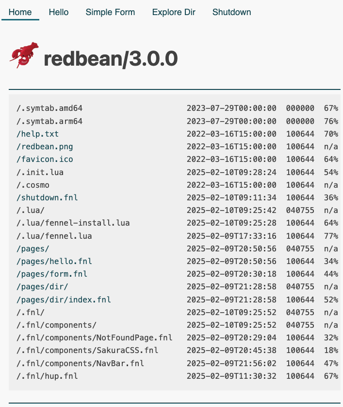

# Intro

A template combining [redbean](https://redbean.dev) & [fennel](https://fennel-lang.org) together. :kissing_heart:


## What / How

This template provides a basic structure for how things are put together.

Fennel sharable/library code should be placed inside `src/.fnl/`; other `fennel` files are treated as CGI apps.

Each `fennel` CGI should return a [table](https://fennel-lang.org/tutorial#tables), where the keys being HTTP methods, and the values being functions that return [hiccup](https://google.com/search?q=clojure+hiccup) components. Check [here](src/pages) for more examples.

You may also want to check [our hiccup implementation](src/.fnl/hup.fnl).


## Installation

```sh
git clone https://github.com/curist/redbean-fennel-template.git
cd redbean-fennel-template
make run
```


## Screenshot




## Prior art

[redbean-fennel-template](https://gitlab.com/actuallyalys/redbean-fennel) by [Alys Brooks](https://gitlab.com/actuallyalys)
